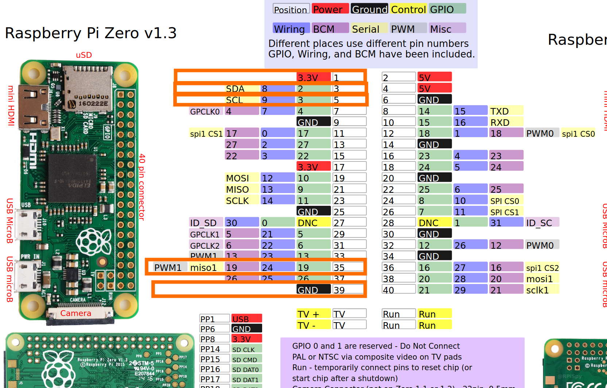

Wraps pigpio (Thanks Joan) interfacing some popular devices and sensors - with helpful defaults and error handling!

- [x] Leds
- [x] PWM Motors and Servos
- [x] Mpu6050 Accelerometer and Gyroscope (IMU)
- [x] Hmc5883l Magnetometer (Compass)
- [x] Bmp180 Barometer (Pressure, Temperature and Altitude)
- [ ] Camera

**Roadmap**

- I'm new to Zig but this is actively maintained and changing as I build an ultra long-range drone. Very open to suggestions for improvement/extensions.
- This does depend on the pigpio library, but I plan to rewrite the GPIO and I2C interfaces in pure Zig.

## Dependencies

**1. Software**

---

SSH into the Pi, clone and navigate into the project and issue `make install`. This installs the following libraries and may take a while.

- [zig](https://ziglang.org/download/)
- [pigpio](http://abyz.me.uk/rpi/pigpio/download.html)
- **Note**: To use I2C, you need to enable it in `raspi-config` and install the `i2c-tools` package.

```bash
sudo apt-get install i2c-tools
sudo raspi-config
make install
```

**2. Hardware**

---

<table>
  <tr>
    <td>
<p>

I've setup the examples for output devices (Led, Servo, etc.) on **pin 19**, and the I2C bus on **pins 2 and 3**. Then VCC on pin 1, 3.3V.

You can change these in `src/examples.zig`.

</p> 
    </td>
    <td>



</td>

  </tr>
</table>

**3. Config**

---

Lastly, change the environment variables at the top of `Makefile` to match your Pi's IP address and username, ensuring you have passwordless SSH access.

## Install

```bash
sudo su
eval $(make env)
make
```

## Run

**Check out `src/examples.zig` for how to use different device modules.**

```bash
sudo su
eval $(make env)
./main
```

## Development

Make changes to the code on your host machine and rsync them to the Pi with

```bash
make push
```

Or grab quick changes made on the Pi with

```bash
make pull
```

### Feedback

Feel free to contribute via pull requests. If this project helps you or if you encounter any issues, please let me know!

<h2 align="center">Contact</h2>
<p align='center'>
	<a href="mailto:yohanderose@gmail.com?subject=Hello">📧 Email</a>
	<a href="https://yohanderose.dev">👨🏾 Website</a>
	<a href="https://www.buymeacoffee.com/yderose">🍻 Donate</a>
</p>
